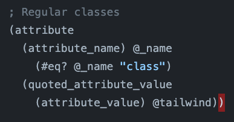
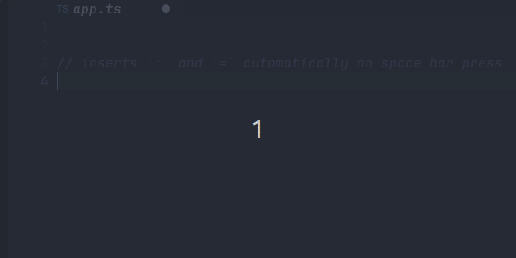
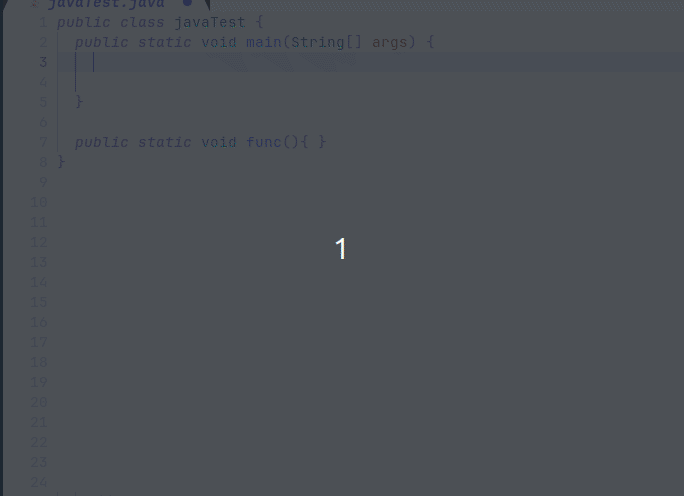
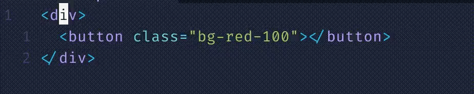
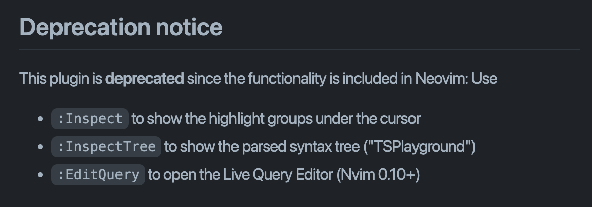
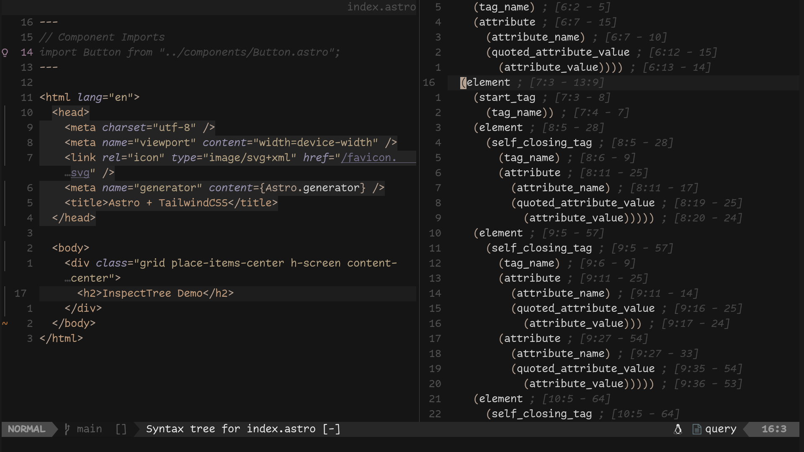

## 자기소개

<!-- column_layout: [2, 1] -->

<!-- column: 0 -->

안녕하세요! 반갑습니다.

- 차주훈(jcha0713)
- [jhcha.app](https://jhcha.app)
- web dev -> **software builder**

### 내가 좋아하는 것:

- 💗Neovim💗
- Astro
- HHKB
- Raycast
- CLI Apps

<!-- column: 1 -->


<!-- reset_layout -->

<!-- end_slide -->

## 목차

1. 트리시터란?
2. 트리시터 활용 플러그인
3. classy.nvim
4. 0.10 업데이트로 바뀐 부분
5. bye 2023...

<!-- end_slide -->

## 트리시터(Tree-sitter)란?

많이 들어봤는데... 트리시터가 뭐지?


<!-- end_slide -->

```
Tree-sitter is an open source parsing framework that
1. generates parsers
2. and incrementally parses your code.

It uses an incremental version of generalized LR parsing,
enabling language-aware features for a general-purpose editor
that were once only possible in language-specific IDEs.
```

`Tree-sitter`는 오픈소스 구문 분석 프레임워크로서

1. 작성 중인 파일의 수정 사항을 점진적으로 반영하고 구문을 분석
2. 에디터 종류에 구애 받지 않고 동일한 문법으로 언어를 분석하고 그에 맞는 기능을 제공할 수 있다는 장점을 가짐

<!-- end_slide -->

### 트리시터의 탄생 배경


1. 트리시터는 Max Brunsfeld의 취미 프로젝트로 시작
2. GitHub 팀에 의해 진지한 프로젝트로 발전
3. 현재는 GitHub와 Neovim 등 여러 대형 서비스/앱에서 사용 중

<!-- end_slide -->

](./media/ts.gif)
트리시터 프로젝트를 시작한 팀은 현재 `Zed` 에디터 개발 중

<!-- end_slide -->

### 왜 만들어진 걸까?

트리시터는 기존 IDE가 가지고 있는 문제점을 해결하기 위해서 시작된 프로젝트이다.

기존의 문제점이란:

1. 하나 또는 적은 수의 언어에만 맞춰진 개발 환경
2. 큰 파일를 파싱할 때 오래 걸리는 점(느린 하이라이팅 업데이트)

### Neovim과의 조합

트리시터는 Neovim을 위해 시작된 프로젝트는 아니지만 Neovim이 겪고 있는 문제를 효과적으로 해결했다.

- Neovim 0.5 버전부터 공식 지원
- 규칙적인 구문 하이라이팅과 빠른 코드 분석
  - 이전 방식은 특히 jsx/tsx를 사용하는 모던 웹 개발 환경에서 큰 불편을 초래

#### LSP와의 차이점?

둘 다 0.5 버전부터 지원

간단히 말해서

- LSP(Language Server Protocol)는 주로 프로젝트 범위 내에서 언어 서버와 통신하는 프로토콜
  - 오류 분석/코드 완성 등의 편의를 제공
- 트리시터는 버퍼 내에서 구문을 분석하는 툴(파서)

<!-- end_slide -->

### 환상의 조합


<!-- end_slide -->

## 트리시터 활용 플러그인

### tailwind-sorter.nvim



언어 별로 쿼리를 작성, `Tailwind` 클래스 속성 값을 찾아 정렬

정렬 알고리즘을 바꾸면 마음대로 커스텀할 수 있다

[laytan/tailwind-sorter.nvim](https://github.com/laytan/tailwind-sorter.nvim)

<!-- end_slide -->

### tree-setter

#### Typescript



`=`, `;` 자동 입력기

<!-- end_slide -->

#### Java



[filNaj/tree-setter](https://github.com/filNaj/tree-setter)

<!-- end_slide -->

### 나만의 생산성 핵

자신이 애용하는 언어에 맞는 쿼리를 작성하고 이것저것 시도해보자

생산성 핵을 제조할 수 있을지도 모른다...

<!-- end_slide -->

## classy.nvim

트리시터를 활용해 만든 플러그인

[classy.nvim](https://github.com/jcha0713/classy.nvim)

### 어떻게 시작하게 됐나?

트위터에서 우연히 본 영상



트리시터를 이용해서 `HTML` 태그 안에 `class` 속성을 추가

1. `class="..."` 속성이 이미 존재하면 커서 옮기기
2. 속성이 없다면 자동으로 추가하기

<!-- end_slide -->

### 이게 과연 필요할까?

```html
<div class="...">
  <div class="...">
    <div>
      <div class="...">
        <div class="...">
          <div class="..."></div>
        </div>
      </div>
    </div>
  </div>
</div>
```

- `TailwindCSS`에 빠져 있던 나에게 아주 유용해 보였음
- 커서를 직접 옮기고 공백 넣고 `class="..."` 타이핑 아주 귀찮다
- 티끌 모아 태산
  - `HTML` 문서 하나에 클래스 속성 최소 10개, 직접 타이핑하여 넣는 데 소요 시간 3초
    -> 최소 30초 이상 세이브
  - 게다가 문서는 하나가 아니다

<!-- end_slide -->

<!-- jump_to_middle -->


<!-- end_slide -->

### 기능 추가하기

아쉬운 점:

1. `HTML` 파일 내에서만 동작함
2. 닫는 태그에서 동작 안 함
3. 추가 가능, 삭제 불가

-> 그럼 처음부터 직접 만들어보자


<!-- end_slide -->

### 기본 스케치

#### 속성 추가 (`:ClassyAddClass`)

- 태그 위 또는 안에 커서가 있을 때 클래스 속성이 있는지 없는지 알아야 함
  - 커서 위치를 찾고 어떤 종류의 (트리시터) 노드가 있는지 알아보자
    - `vim.treesitter` API
  - 속성이 없다면 `class=""`를 자동 추가하고 있다면 제일 끝으로 커서를 위치
    - `vim.api.nvim_win_get_cursor()`, `vim.api.nvim_win_set_cursor()`

#### 속성 제거 (`:ClassyRemoveClass`)

- 클래스 속성이 존재할 때만 동작
  - `vim.api.nvim_buf_get_lines()`, `vim.api.nvim_buf_set_lines()`

#### 명심할 것

- 궁금한 건 `:help` 또는 GitHub Code Search
- 더 궁금한 건 Reddit, Korean Vim User Group 등의 커뮤니티에 질문하기

<!-- end_slide -->

### JSX/TSX 쿼리 작성

> `HTML` 파일 내에서만 동작함

`React` 내에서도 사용할 수 있도록 `JSX/TSX` 쿼리 작성 필요

#### `jsx`

```
((property_identifier) @attr_name
  (#eq? @attr_name "class") [(jsx_expression (_)?) (string)] @attr_value)
```

#### `HTML`

```
((attribute_name) @attr_name
  (#eq? @attr_name "class") (quoted_attribute_value) @attr_value)
```

<!-- end_slide -->

#### 잠깐, JSX는 보통 `class` 대신 `className` 아닌가?

하 맞다


`class`는 자바스크립트에서 _reserved word_ 이기 때문에 리액트에서는 `className`이 대신 쓰인다

추가로 `HTML`과는 다르게 `JSX`에서는 _self-closing_ 태그가 빈번히 쓰인다

> 이걸 고려해서 감지된 언어가 `javascriptReact` 또는 `typescriptReact` 일 땐 `className`을 넣어준다
> 또 self-closing 태그를 위한 쿼리를 하나 더 써준다

<!-- end_slide -->

#### 최종 쿼리(`JSX`)

```lua
-- for ordinary tags
local class = util.is_jsx(lang) and "className" or "class"
local query = [[((property_identifier) @attr_name (#eq? @attr_name ]]
                .. class ..
                [[) [(jsx_expression (_)?) (string)] @attr_value)]]
```

```lua
-- handling self-closing tags
local query = [[([( jsx_self_closing_element ) ( jsx_opening_element ) ] @open )]]
```

이렇게 쿼리를 작성해주었더니 커서가 닫는 커서에 있더라도 정확한 위치를 찾아간다

<!-- end_slide -->

## 0.9/0.10 버전에서 바뀐 부분

| Feature           | Before v0.10                           | After v0.10                      |
| ----------------- | -------------------------------------- | -------------------------------- |
| `parse_query()`   | `vim.treesitter.query.parse_query()`   | `vim.treesitter.query.parse()`   |
| `get_node_text()` | `vim.treesitter.query.get_node_text()` | `vim.treesitter.get_node_text()` |

[source](https://neovim.io/doc/user/deprecated.html)

이제 `nvim-treesitter/playground`를 따로 추가하지 않아도 된다!

0.9 버전부터 `:InspectTree` 내장, `:EditQuery`도 추가 (0.10+)



<!-- end_slide -->

### `:InspectTree` demo



<!-- end_slide -->

## bye 2023...

참 다사다난 했던 올 한 해

운 좋게 취업에 성공했지만 매운 맛을 맛 봄

느낌 점:

- 코드 작성 말고도 배워야할 게 많구나
- 사람을 많이 만나보자

-> 커피챗 환영, 대화, 쪽지 뭐든 환영

-> 적극적으로 구직 중입니다

-> 함께 하는 프로젝트도 좋습니다

- X [X](https://twitter.com/jcha0713)
- discord **jcha0713**

<!-- end_slide -->

<!-- jump_to_middle -->

새해에는 건강하고

<!-- end_slide -->

<!-- jump_to_middle -->

건강해서 행복한 삶을 삽시다
